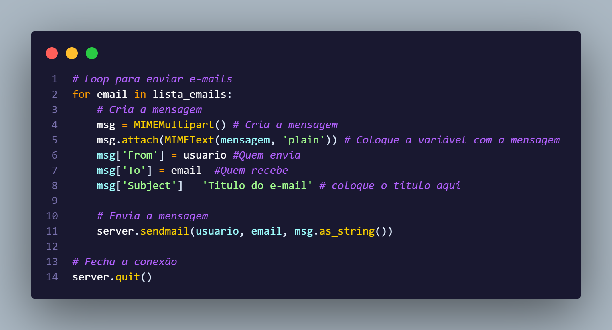

# Desafio_AutomatizarEnvioE-mails
 Código em python que faz o envio de e-mails pelo server SMTP do outlook 

## Para que serve e como funciona

Essa parte do código é a importação das libs, a smtplib, se consiste em uma lib do python para se conectar em servidores de e-mail, já as outras importações são usadas par criar a mensagem e colocar os dados da mensagem.

Essa parte usa as funções da smtplib para se conectar ao servidor.

Esse loop usa das funções importadas além da smtplib para criar a mensagem, colocar os dados necessários para enviar o e-mail e no final ele encerra a conexão com servidor.
